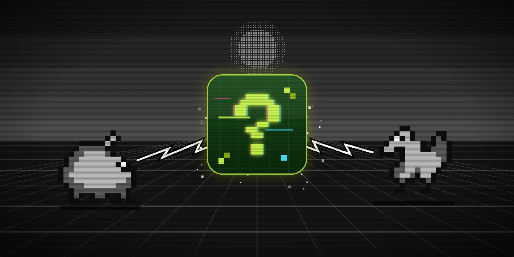

  

<h1 align="center">Project MissingNo</h1>

<em>Teaching a small AI to play Pokémon, and learning how AI is made along the way.</em>

---

## The idea

Project MissingNo is an attempt to build an artificial intelligence that can play the Pokémon games, and play them well: battling, exploring the world, catching Pokémon, beating gyms, and eventually finishing a whole game.

The twist is in *how*. Instead of relying on a huge, expensive AI model running somewhere in the cloud, the goal is to build something **small, open and trained from scratch**: models that anyone can download, inspect and run on their own computer. The aim is not just to finish a game once by luck, but to get an AI that plays sensibly in general, and maybe one day can pick up a Pokémon game it has never seen before.

It is also a personal journey. This project is how I am learning, hands-on, how AI models are actually trained. I know these games inside out; machine learning, not yet. Every step, including the failures, will be documented in the [journal](JOURNAL.md).

## Why "MissingNo"

Anyone who played the original Red and Blue remembers the rumors. There was a strange creature you could meet through a trick on Cinnabar Island's coast: a garbled block of pixels with no proper name, no Pokédex entry, and a reputation for messing with your save file. Its name, *MissingNo.*, is short for "missing number": it was never meant to exist. It appeared because the game was reading its own memory in a place where no real data lived.

It became a playground legend, and it felt like the right name for this project. This AI also lives inside the game's memory, reading it to understand what is happening. And like the original, it is something the game was never designed to contain: a player that is not a person.

## What inspired it

Pokémon has quietly become one of the most interesting playgrounds for artificial intelligence.

In 2014, **Twitch Plays Pokémon** let tens of thousands of people play Pokémon Red together by typing commands into a chat. It was chaotic, hilarious, and somehow it worked.

In 2023, a video by **Peter Whidden** showed an AI learning to play Pokémon Red completely on its own, starting from random button presses. That project grew into an open community effort that, in 2025, managed to beat the whole game.

Since then, large AI systems from several major labs have played and finished the original games, though with a lot of help from custom-built tools. And in 2025, Pokémon got its own research competition at NeurIPS, one of the biggest AI conferences in the world, with over a hundred teams building AI players.

What is still missing is a small, open AI that plays these games well in a general way, built by someone who knows the games deeply. That is the gap this project wants to explore.

## Where we are

**Phase 1: prototype.** The main choices are made:

- **One agent that learns everything by itself.** It only sees the screen and presses buttons, like a player would.
- **No help from outside.** It never watches humans play and never gets walkthrough knowledge. It can know what a game's instruction booklet would tell you, but not what a strategy guide would.
- **The same rules for every game.** It is rewarded for generic progress (discovering new places, earning badges, growing its team), never for game-specific events.
- **Tested on games it has never seen.** After learning on some games, it will be dropped into others to see what carries over.

The game environment is built and tested. The next step is the first round of learning experiments on the opening of Pokémon Red, from the bedroom to Viridian City, comparing different ways of exploring.

## The road ahead

1. **Prototype:** find out which way of exploring makes learning from scratch possible.
2. **One game:** see how far the agent gets in Pokémon Red.
3. **Several games:** train on a few games and test on others it has never seen.
4. **Full games:** an agent that can finish them.

Each step is designed to be useful on its own, even if the next one turns out harder than expected.

## Follow along

- 📓 [Journal](JOURNAL.md): what was tried, what broke, what was learned
- 🔬 [Research design](docs/research.md): the questions, hypotheses and experiments behind the project
- 🛠️ [Setup](docs/SETUP.md): for anyone who wants to run the code

## Disclaimer

This is an unofficial fan and research project. It is not affiliated with, endorsed by, or connected to Nintendo, Game Freak, Creatures Inc. or The Pokémon Company. Pokémon and all related names are trademarks of their respective owners. No game files (ROMs) are included or distributed: anyone running the code must use a legally obtained copy of their own game.
