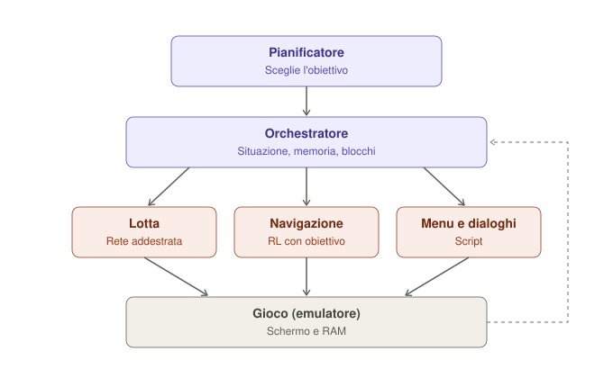

# Progetto MissingNo — un agente orchestrato che gioca a Pokémon

*Progetto personale per imparare ad allenare modelli, costruendo un agente orchestrato capace di giocare e avanzare nei giochi Pokémon. La letteratura scientifica fa da supporto, la conoscenza del gioco da vantaggio.*

---

## Obiettivo

Costruire un agente **orchestrato**: un sistema che riconosce la situazione di gioco e attiva l'abilità adatta, con modelli piccoli e open addestrati da zero. L'obiettivo di lungo periodo è completare un gioco intero con un agente che gioca bene **in modo generale** (non solo in una run fortunata) e poi verificare quanto si trasferisce a un gioco diverso senza regole scritte apposta.

Il progetto ha anche un obiettivo di apprendimento: capire concretamente come si allenano i modelli, dal supervised learning al reinforcement learning.

## Stato dell'arte e spazio libero

- **Rosso è già stato battuto con RL open.** Il progetto PokeRL (Rubinstein, Whidden et al., con PufferLib) lo ha completato a febbraio 2025 con una policy da meno di 10M di parametri e poche semplificazioni. Codice open: `drubinstein/pokemonred_puffer`. Documentazione dettagliata: drubinstein.github.io/pokerl
- **Ma** gli autori precisano che il risultato è una tecnica per produrre soluzioni al gioco, non una policy capace di giocare bene in generale. Il training resta fragile: loop di azioni, spam dei menu, vagabondaggio.
- **Nessun modello linguistico open** ha completato un gioco Pokémon (PokéAgent Challenge, 2026).

Lo spazio libero per MissingNo:

- un agente **generale**, che gestisce situazioni nuove invece di memorizzare una partita;
- un **vero modulo di lotta** invece di semplificazioni;
- un'architettura **orchestrata** e modulare;
- il **trasferimento** a un altro gioco.

## Il contributo

Il vantaggio di partenza è la conoscenza approfondita del gioco. Chi fa ricerca su questi agenti di solito conosce bene il machine learning ma il gioco solo in superficie; qui la situazione è opposta.

Contributi concreti che il progetto può lasciare:

- **Un benchmark di "punti difficili"** curato da un esperto: savestate posizionati nei momenti in cui un agente tipicamente si blocca, ognuno con la descrizione di cosa serve per superarlo. Misura proprio la capacità di gestire situazioni note senza ripartire da capo.
- **Uno studio sulla conoscenza di dominio**: quanto aiutano ricompense, curriculum e valutazione progettati da un esperto rispetto a scelte generiche.
- **Codice e modelli open**, pubblicati su GitHub e Hugging Face.
- **Un diario di sviluppo** che racconta come si impara il machine learning partendo da zero, errori inclusi.

---

## Architettura orchestrata

Architettura **modulare e gerarchica** (in letteratura: *hierarchical RL*, *options framework*), non un Mixture of Experts in senso tecnico.



*Il pianificatore sceglie l'obiettivo, l'orchestratore attiva il modulo giusto, lo stato del gioco torna all'orchestratore (freccia tratteggiata).*

### Due livelli di decisione, con ritmi diversi

- **Orchestratore — decide a ogni passo quale modulo è attivo.** Usa regole semplici lette dalla RAM: lotta in corso → modulo lotta; dialogo o menu aperto → modulo menu; altrimenti → navigazione. Veloce e affidabile, non va addestrato.
- **Pianificatore — decide ogni tanto cosa conviene fare.** Esempi: "vai al centro Pokémon", "allenati prima di Misty", "prendi la Bici". Viene interpellato solo quando un obiettivo è completato o fallito, quindi può essere un LLM open lento e ragionante senza rallentare il gioco.

### Le abilità ricevono un obiettivo (goal-conditioned)

Punto tecnico centrale. Le abilità non imparano "gioca a Rosso", ma compiti con un obiettivo dato come input (*goal-conditioned RL*):

- **Navigazione**: "raggiungi questo punto della mappa". La stessa abilità serve per Celestopoli, il Monte Luna e, in principio, un altro gioco.
- **Lotta**: "vinci", oppure "indebolisci senza mettere KO" quando si vuole catturare.

È ciò che rende l'agente generale invece che legato a un'unica partita.

### Memoria e rilevamento dei blocchi

L'orchestratore tiene traccia di luoghi visitati, squadra, oggetti e obiettivi raggiunti. Se l'agente gira in tondo troppo a lungo, richiama il pianificatore per cambiare strategia. I "punti difficili" sono i test che verificano questo meccanismo.

### I moduli

- **Lotta**: stato strutturato (Pokémon, PS, mosse, tipi). Addestrato da zero con imitation learning e poi RL.
- **Navigazione**: mappa o schermo + obiettivo. Addestrata da zero con RL goal-conditioned e ricompense progettate a mano.
- **Menu e dialoghi**: in gran parte script.
- **Pianificatore**: LLM open esistente, non addestrato da zero.
- **Orchestratore**: regole + memoria, non addestrato.

### Evoluzione futura

Le decisioni prese dal pianificatore LLM diventano dati per addestrare un piccolo modello che lo sostituisce, molto più veloce. È lo schema che ha vinto lo speedrun della PokéAgent Challenge (LLM come guida iniziale, distillazione e RL come rifinitura). A quel punto ogni pezzo di MissingNo è addestrato da noi.

---

## Strumenti

- **Python + PyTorch** per i modelli
- **Git + GitHub** per il codice
- **Weights & Biases** (o MLflow) per registrare ogni esperimento
- **Hugging Face** per versionare modelli e dataset
- **Pokémon Showdown** in locale (Node.js) + **poke-env** per le lotte
- **PyBoy** (emulatore Game Boy in Python) per la navigazione, con una copia di Rosso ottenuta legalmente da una cartuccia propria
- **PufferLib** e il codice di PokeRL come base per l'RL in Rosso

## Struttura del repository

```
missingno/
├── battle/         # modulo lotta: dati, training, valutazione
├── navigation/     # modulo navigazione goal-conditioned: ambiente, ricompense, training
├── menus/          # script per menu e dialoghi
├── orchestrator/   # rilevamento situazione, memoria, rilevamento blocchi
├── planner/        # pianificatore LLM (più avanti)
├── checkpoints/    # i "punti difficili": savestate + descrizioni
├── notebooks/      # esplorazioni e grafici
└── JOURNAL.md      # diario: cosa si è provato, cosa è andato storto, perché
```

---

## Fasi

### Fase 0 — Ambiente (settimana 1)

- Installare Python, PyTorch, Git, Weights & Biases.
- Avviare un server Showdown locale e collegarlo con poke-env.
- Installare PyBoy e verificare che il gioco si avvii e sia controllabile da Python.
- Creare il repository e il file `JOURNAL.md`.

### Fase 1 — Lotte per imitazione (settimane 2–5)

Apprendimento supervisionato puro: il caso più semplice e istruttivo. Un solo formato, per esempio **Gen 1 OU**.

1. Scrivere un **agente casuale** e un **agente euristico** (es. "usa la mossa più efficace per tipo") come riferimenti.
2. Scaricare i dati di lotte umane rilasciati dal progetto Metamon.
3. Scrivere la codifica dello stato di lotta in numeri (qui la conoscenza del gioco conta molto).
4. Addestrare un modello piccolo a prevedere la mossa del giocatore umano: prima un MLP, poi un Transformer.
5. Fin da subito, prevedere l'**obiettivo** come input (anche se all'inizio è sempre "vinci").

**Criterio di riuscita:** il modello batte costantemente l'agente euristico sul server locale.

### Fase 2 — Lotte con RL (settimane 6–10)

1. Far giocare il modello della fase 1 contro sé stesso e contro le baseline.
2. Migliorarlo con reinforcement learning (ricompense, stabilità del training).
3. Portarlo sul leaderboard pubblico della PokéAgent Challenge per confrontarlo con le baseline.

**Criterio di riuscita:** supera il modello della fase 1.

### Fase 3 — Navigazione (settimane 11–18)

1. **Riprodurre PokeRL** come primo passo: si sa che deve funzionare, quindi se non funziona l'errore è nostro. Studiare la sua documentazione su osservazioni, ricompense, lettura della RAM.
2. Trasformare la navigazione in **goal-conditioned**: l'agente riceve come input la destinazione.
3. Progettare le ricompense usando la conoscenza del gioco, con attenzione ai problemi noti (loop, spam dei menu).
4. In parallelo, iniziare la collezione di punti difficili.

**Criterio di riuscita:** dato un obiettivo, l'agente raggiunge in modo affidabile destinazioni diverse (es. da Biancavilla a Plumbeopoli, e ritorno).

### Fase 4 — Orchestrazione (dopo)

1. Orchestratore a regole che passa il comando tra lotta, navigazione e menu.
2. Memoria dello stato di gioco e rilevamento dei blocchi.
3. Pianificatore con un LLM open che assegna gli obiettivi.
4. Misurare i progressi sui punti difficili.

### Fase 5 — Distillazione e trasferimento (obiettivo ambizioso)

1. Usare le decisioni del pianificatore per addestrare un piccolo modello sostitutivo.
2. Provare il sistema su un secondo gioco senza regole specifiche, e documentare cosa si trasferisce e cosa no.

*I tempi sono indicativi: l'ordine conta più della velocità.*

---

## Tre regole

1. **Partire in piccolo.** Modello minuscolo, pochi dati, e verificare che riesca almeno a imparare a memoria un piccolo campione. Se non ci riesce, c'è un bug.
2. **Confrontarsi sempre con una baseline semplice.** Un numero da solo non dice niente.
3. **Cambiare una cosa alla volta** tra un esperimento e l'altro, annotandola nel diario.

## Tracciabilità

- Codice su GitHub con commit frequenti.
- Ogni esperimento registrato (iperparametri, curve, risultati).
- Modelli e dataset importanti versionati su Hugging Face.
- Diario aggiornato a ogni sessione.

---

## Tempi indicativi per i primi risultati

*(circa 10 ore a settimana, buona conoscenza di Python, nuovi al machine learning)*

- **1–2 settimane:** server Showdown locale e agente euristico che gioca lotte complete.
- **3–4 settimane:** primo modello addestrato che batte l'agente casuale.
- **1–2 mesi:** modello che batte con costanza l'euristica.
- **Navigazione:** esplorazione sensata nelle prime settimane della fase 3; destinazioni affidabili dopo qualche iterazione sulle ricompense.

Le prime settimane sono sempre le più frustranti: annotare ogni piccolo traguardo nel diario.

## Risorse di calcolo

- **Fasi 1–2:** bastano Kaggle o una GPU consumer (i modelli di lotta efficaci stanno sotto i 200M di parametri, e si parte molto più in piccolo).
- **Fase 3:** l'emulazione usa soprattutto CPU.
- **CINECA (ISCRA):** la domanda può farla solo un PI affiliato a un'università o ente di ricerca italiano, con revisione tra pari e relazione finale. Non è garantita e trasforma il progetto in ricerca del gruppo. Strategia: prima ottenere risultati preliminari, poi presentarli al PI; i risultati servono dentro la domanda, non vanno inviati a CINECA prima. Esiste la possibilità di un progetto "try" per stimare le risorse (info: iscra@cineca.it).

## Sul nome

*MissingNo* è il glitch leggendario della prima generazione, nato da un errore nella memoria del gioco: un'intelligenza artificiale che vive nella RAM di Rosso. Alternative: *Helix* (Twitch Plays Pokémon), *Red*, *Porygon*. Nota: i nomi Pokémon sono marchi registrati; per un progetto personale o di ricerca open va bene, ma per un prodotto conviene rinominare.

## Riferimenti

- *The PokéAgent Challenge: Competitive and Long-Context Learning at Scale* (Karten, Grigsby et al., 2026) — benchmark di riferimento, dataset e baseline. Sito: pokeagentchallenge.com
- *Metamon*: Grigsby et al., *Human-level competitive Pokémon via scalable offline reinforcement learning with transformers* (2025)
- *PokéChamp*: Karten et al., *An expert-level minimax language agent* (ICML 2025)
- Pleines, Addis, Rubinstein, Zimmer, Preuss, Whidden, *Pokémon Red via reinforcement learning* (IEEE CoG 2025)
- PokeRL — *Learning Pokémon With Reinforcement Learning*: drubinstein.github.io/pokerl · codice: github.com/drubinstein/pokemonred_puffer
- Mudireddy, Patibandla, *PokeRL: Reinforcement Learning for Pokémon Red* (2026) — wrapper anti-loop e ricompense gerarchiche per l'inizio del gioco
- PokemonRedExperiments (P. Whidden) — il progetto originale
- FoulPlay (P. Mariglia) — bot basato su ricerca, vincitore Gen 9 OU alla competizione NeurIPS 2025
