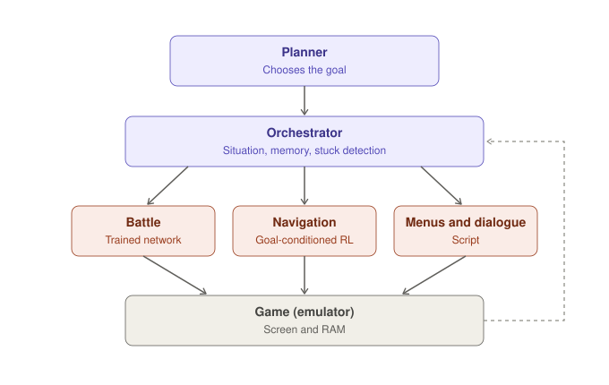

# Project MissingNo — Working plan

> **Working draft.** This is the current hypothesis, not a final design. The architecture is still being studied and will change as we learn.

*A personal project to learn how AI models are trained, by building an agent that plays and progresses through the Pokémon games. Scientific literature as backup, deep knowledge of the games as an advantage.*

---

## Goal

Build an agent made of small, open models trained from scratch. The long-term goal is to complete an entire game with an agent that plays well **in general** (not just in one lucky run), and then check how much transfers to a different game without rules written specifically for it.

The project also has a learning goal: understanding in practice how models are trained, from supervised learning to reinforcement learning.

## State of the art and open space

- **Pokémon Red has already been beaten with open RL.** The PokeRL project (Rubinstein, Whidden et al., with PufferLib) completed it in February 2025 with a policy under 10M parameters and few simplifications. Open code: `drubinstein/pokemonred_puffer`. Detailed documentation: drubinstein.github.io/pokerl
- **However**, the authors note that the result is a technique for producing solutions to the game, not a policy that plays well in general. Training remains fragile: action loops, menu spamming, aimless wandering.
- **No open language model** has completed a Pokémon game (PokéAgent Challenge, 2026).

Open space for MissingNo:

- a **general** agent that handles new situations instead of memorizing one playthrough;
- a **real battle module** instead of simplifications;
- a modular, coordinated design (to be validated);
- **transfer** to another game.

## Contribution

The starting advantage is deep knowledge of the games. People researching these agents usually know machine learning well but the games only superficially; here it is the other way around.

Concrete contributions the project could leave:

- **A "hard spots" benchmark** curated by an expert: save states placed where agents typically get stuck, each with a description of what is needed to get past it. It measures exactly the ability to handle known situations without starting over.
- **A study on domain knowledge**: how much expert-designed rewards, curriculum and evaluation help compared to generic choices.
- **Open code and models**, published on GitHub and Hugging Face.
- **A development journal** about learning machine learning from zero, mistakes included.

---

## Candidate architecture: orchestrated

The current leading hypothesis is a **modular, hierarchical** design (in the literature: *hierarchical RL*, *options framework*; related work: SayCan, Voyager, DEPS, JARVIS-1). This is not a Mixture of Experts in the technical sense. The alternative to keep in mind is an **end-to-end** approach (one model from pixels to actions, e.g. VPT); the trade-off between the two is itself one of the questions to study.

*The planner chooses the goal, the orchestrator activates the right module, the game state flows back to the orchestrator (dashed arrow).*

### Two levels of decision, at different speeds

- **Orchestrator — decides at every step which module is active.** Simple rules read from memory: battle in progress → battle module; dialogue or menu open → menu module; otherwise → navigation. Fast, reliable, not trained.
- **Planner — decides every now and then what to do.** For example: "go to the Pokémon Center", "train before Misty", "get the Bicycle". Only called when a goal is completed or fails, so it can be a slow, reasoning open LLM without slowing the game down.

### Skills receive a goal (goal-conditioned)

The central technical idea. Skills don't learn "play Red", but tasks with a goal given as input (*goal-conditioned RL*):

- **Navigation**: "reach this point on the map". The same skill works for Cerulean City, Mt. Moon and, in principle, another game.
- **Battle**: "win", or "weaken without knocking out" when trying to catch.

This is what would make the agent general instead of tied to a single playthrough.

### Memory and stuck detection

The orchestrator keeps track of visited places, party, items and goals reached. If the agent loops for too long, it calls the planner to change strategy. The hard spots are the tests for this mechanism.

### The modules

- **Battle**: structured state (Pokémon, HP, moves, types). Trained from scratch with imitation learning, then RL.
- **Navigation**: map or screen + goal. Trained from scratch with goal-conditioned RL and hand-designed rewards.
- **Menus and dialogue**: mostly scripted.
- **Planner**: an existing open LLM, not trained from scratch.
- **Orchestrator**: rules + memory, not trained.

### Future evolution

The planner LLM's decisions become data to train a small replacement model, much faster. This is the scheme that won the PokéAgent Challenge speedrun track (LLM as initial guide, then distillation and RL to refine). At that point every piece of MissingNo would be trained by us.

---

## Tools

- **uv** for Python, dependencies and the workspace
- **Ruff**, **pytest**, **pre-commit** for code quality
- **Pydantic** for shared, validated types
- **PyTorch** for models
- **Gymnasium** as the environment interface, **PufferLib** for fast parallel RL
- **Weights & Biases** (or MLflow) to log every experiment
- **Hugging Face** to version models and datasets
- **Pokémon Showdown** locally (Node.js) + **poke-env** for battles
- **PyBoy** (Game Boy emulator in Python) for navigation, with a legally obtained copy of Red from your own cartridge
- An open LLM served locally with **Ollama**, **llama.cpp** or **vLLM** for the planner (OpenAI-compatible API, so swapping models is trivial)

---

## Phases

### Phase 0 — Environment (week 1) ✅

- Install Python, PyTorch, Git, Weights & Biases.
- Run a local Showdown server and connect it with poke-env.
- Install PyBoy and check the game starts and can be controlled from Python.
- Create the repository and `JOURNAL.md`.

### Phase 1 — Battles by imitation (weeks 2–5)

Pure supervised learning: the simplest and most instructive case. One format only, e.g. **Gen 1 OU**.

1. Write a **random agent** and a **rule-based agent** as reference points, then improve the rule-based one with real game knowledge.
2. Download the human battle data released by the Metamon project.
3. Write the encoding of the battle state into numbers (game knowledge matters a lot here).
4. Train a small model to predict the human player's move: first an MLP, then a Transformer.
5. From the start, include the **goal** as an input (even if at first it is always "win").

**Success criterion:** the model consistently beats the rule-based agent on the local server.

### Phase 2 — Battles with RL (weeks 6–10)

1. Have the phase 1 model play against itself and against baselines.
2. Improve it with reinforcement learning (rewards, training stability).
3. Take it to the public PokéAgent Challenge leaderboard to compare it with the baselines.

**Success criterion:** it beats the phase 1 model.

### Phase 3 — Navigation (weeks 11–18)

1. **Reproduce PokeRL** as the first step: we know it should work, so if it doesn't, the bug is ours. Study its documentation on observations, rewards, and memory reading.
2. Make navigation **goal-conditioned**: the agent receives the destination as input.
3. Design rewards using game knowledge, paying attention to known problems (loops, menu spamming).
4. In parallel, start the hard spots collection.

**Success criterion:** given a goal, the agent reliably reaches different destinations (e.g. Pallet Town to Pewter City, and back).

### Phase 4 — Putting it together (later)

1. Rule-based orchestrator switching between battle, navigation and menus.
2. Game state memory and stuck detection.
3. Planner with an open LLM assigning goals.
4. Measure progress on the hard spots.

### Phase 5 — Distillation and transfer (ambitious goal)

1. Use the planner's decisions to train a small replacement model.
2. Try the system on a second game without game-specific rules, and document what transfers and what doesn't.

*Timings are indicative: order matters more than speed.*

---

## Three rules

1. **Start small.** Tiny model, little data, and check that it can at least memorize a small sample. If it can't, there's a bug.
2. **Always compare against a simple baseline.** A number on its own says nothing.
3. **Change one thing at a time** between experiments, and write it down in the journal.

## Traceability

- Code on GitHub with frequent commits.
- Every experiment logged (hyperparameters, curves, results).
- Important models and datasets versioned on Hugging Face.
- Journal updated every session.
- Every agent decision logged as JSONL in `traces/`: useful for debugging now, and the dataset for distillation later.

---

## Expected timing for first results

*(about 10 hours a week, comfortable with Python, new to machine learning)*

- **1–2 weeks:** local Showdown server and a rule-based agent playing full battles.
- **3–4 weeks:** first trained model that beats the random agent.
- **1–2 months:** model that consistently beats the rule-based agent.
- **Navigation:** sensible exploration in the first weeks of phase 3; reliable destinations after a few iterations on the rewards.

The first weeks are always the most frustrating: write down every small milestone in the journal.

## Compute

- **Phases 1–2:** Kaggle or a consumer GPU is enough (effective battle models stay under 200M parameters, and we start much smaller).
- **Phase 3:** emulation is mostly CPU.
- **CINECA (ISCRA):** only a PI affiliated with an Italian university or research institution can apply, with peer review and a final report. Approval is not guaranteed and it turns the project into group research. Strategy: get preliminary results first, then present them to the PI; results go inside the application, they are not sent to CINECA beforehand. A small "try" project exists to estimate resources (info: iscra@cineca.it).

## Where to publish

IEEE Conference on Games (CoG), AIIDE, NeurIPS/ICLR/ICML workshops, the NeurIPS Datasets & Benchmarks track (for the hard spots), future editions of the PokéAgent Challenge, IEEE Transactions on Games, and arXiv in any case. Outside academia: a video, a well-kept repository and the journal.

## About the name

*MissingNo.* is the legendary glitch of the first generation, born from the game reading its own memory where no data existed: an AI that lives in Pokémon Red's memory. Pokémon names are registered trademarks; fine for a personal or open research project, but worth renaming for a commercial product.

## References

- *The PokéAgent Challenge: Competitive and Long-Context Learning at Scale* (Karten, Grigsby et al., 2026) — reference benchmark, datasets and baselines. Site: pokeagentchallenge.com
- *Metamon*: Grigsby et al., *Human-level competitive Pokémon via scalable offline reinforcement learning with transformers* (2025)
- *PokéChamp*: Karten et al., *An expert-level minimax language agent* (ICML 2025)
- Pleines, Addis, Rubinstein, Zimmer, Preuss, Whidden, *Pokémon Red via reinforcement learning* (IEEE CoG 2025)
- PokeRL — *Learning Pokémon With Reinforcement Learning*: drubinstein.github.io/pokerl · code: github.com/drubinstein/pokemonred_puffer
- Mudireddy, Patibandla, *PokeRL: Reinforcement Learning for Pokémon Red* (2026) — anti-loop wrappers and hierarchical rewards for the early game
- PokemonRedExperiments (P. Whidden) — the original project
- FoulPlay (P. Mariglia) — search-based bot, Gen 9 OU winner at the NeurIPS 2025 competition
- Sutton, Precup, Singh, *Between MDPs and semi-MDPs: A framework for temporal abstraction in reinforcement learning* (1999) — the options framework
- Related orchestrated agents: SayCan (2022), Voyager, DEPS, JARVIS-1 (Minecraft)
- Sutton, *The Bitter Lesson* (2019) — the case for end-to-end, general methods
